<div align="center">


</div>

<div align="center">

[](https://git.io/typing-svg)

</div>

---

## Sobre mim

```ts
const erick = {
  name:     "Erick Novaes",
  role:     "Full Stack Developer",
  location: "Brasil 🇧🇷",
  stack: {
    backend:  ["Node.js", "PHP", "REST APIs"],
    frontend: ["React.js", "TanStack Router", "TypeScript"],
    database: ["MySQL", "PostgreSQL"],
    arch:     ["DDD", "Clean Architecture", "Modular Monolith"],
  },
  currently: "Construindo software que escala e é fácil de manter",
};
```

---

## Stack & Ferramentas

### Backend
<p>
  
</p>

### Frontend
<p>
  
</p>

### Banco de Dados
<p>
  
</p>

### DevOps & Ferramentas
<p>
  
</p>

---

## Arquitetura & Padrões

<div align="center">

| Padrão | Descrição |
|--------|-----------|
| **DDD** | Domain-Driven Design — modelagem centrada no domínio de negócio |
| **Clean Architecture** | Separação clara de responsabilidades e inversão de dependências |
| **Modular Monolith** | Monolito com módulos bem isolados, preparado para escalar |
| **REST APIs** | Design de APIs semânticas, versionadas e documentadas |

</div>

---

## Métricas do GitHub

<div align="center">



</div>

<div align="center">


</div>

<div align="center">

[](https://github.com/erickn-dev)

</div>

---

## Contribuições

<div align="center">

<picture>
  <source media="(prefers-color-scheme: dark)" srcset="https://raw.githubusercontent.com/erickn-dev/erickn-dev/output/github-contribution-grid-snake-dark.svg" />
  <source media="(prefers-color-scheme: light)" srcset="https://raw.githubusercontent.com/erickn-dev/erickn-dev/output/github-contribution-grid-snake.svg" />
  
</picture>

</div>

---

## Onde me encontrar

<div align="center">

[](https://github.com/erickn-dev)
[](https://linkedin.com/in/ericknovaes)
[](mailto:erick@email.com)

</div>

---

<div align="center">


</div>
